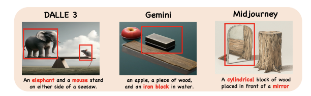
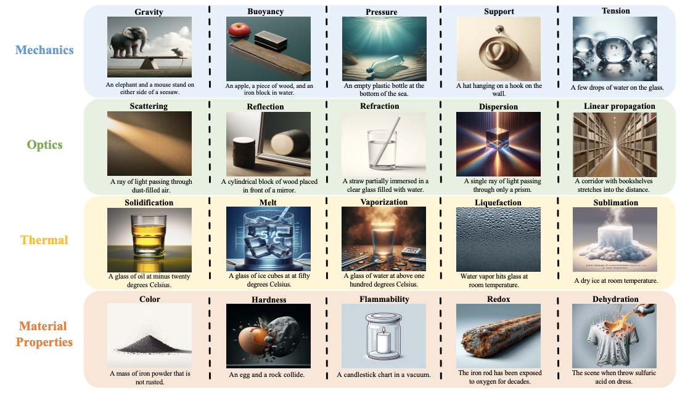
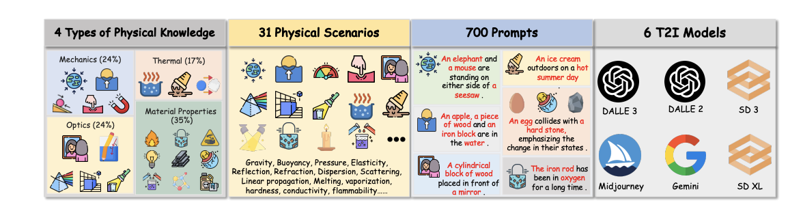
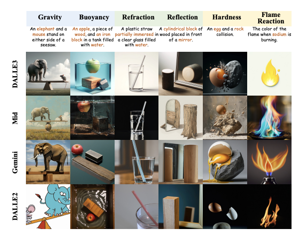
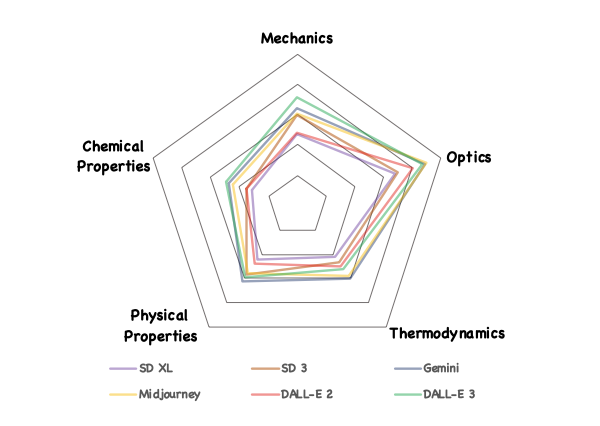

# PhyBench

**PhyBench: A Physical Commonsense Benchmark for Evaluating Text-to-Image Models**

## Introduction
Text-to-image (T2I) models have made substantial progress in generating images from textual prompts. However, they frequently fail to produce images consistent with physical commonsense, a vital capability for applications in world simulation and everyday tasks. Current T2I evaluation benchmarks focus on metrics such as accuracy, bias, and safety, neglecting the evaluation of models’ internal knowledge, particularly physical commonsense. To address this issue, we introduce PhyBench, a comprehensive T2I evaluation dataset comprising 700 prompts across four primary categories: mechanics, optics, thermodynamics, and material properties, encompassing 31 distinct physical scenarios. We assess 6 prominent T2I models, including proprietary models DALLE3 and Gemini, and demonstrate that incorporating physical principles into prompts enhances the models’ ability to generate physically accurate images. Our findings reveal that: (1) even advanced models frequently err in various physical scenarios, except for optics; (2) GPT-4o, with item-specific scoring instructions, effectively evaluates the models’ understanding of physical commonsense, closely aligning with human assessments; and (3) current T2I models are primarily focused on text-toimage translation, lacking profound reasoning regarding physical commonsense. We advocate for increased attention to the inherent knowledge within T2I models, beyond their utility as mere image generation tools.

## PhyBench
we introduce PhyBench, focusing on 4 types of physical knowledge, including optics, mechanics, thermodynamics, and material properties. PhyBench encompasses a total of 700 prompts, spaning 31 physical scenarios about gravity, light scattering, ice melt, and more。

## Result

We find that even in the simplest scenarios, current text-to-image (T2I) models are prone to errors. For example, for the prompt "A cylindrical block of wood placed in front of a mirror", DALL-E 3 and Midjourney incorrectly depict objects in a mirror. Similarly, for "An apple, a piece of wood, and an iron block in a tank filled with water", DALL-E 3, Gemini, and Midjourney all misrepresent the state of one or more objects, while DALL-E 2 omits an object entirely

Thorugh extensive evaluation, we have several observations. 1) The scenes we design are simple enough that most models are able to depict them based on the prompts. 2) The machine scoring results show a high correlation with manual evaluation outcomes under our previous designs, indicating that GPT-4o can serve as an excellent humanaligned scorer on PhyBench. 3) As shown in Fig. 6, although the models can render the scenes, their performance on physical correctness is generally poor, with only optical scenarios showing relatively better results. 4) Open-source models exhibit a significant gap in understanding physical commonsense compared to proprietary models. In Fig. 9 in appendix, we present qualitative visual results and compare the performance of different models.

